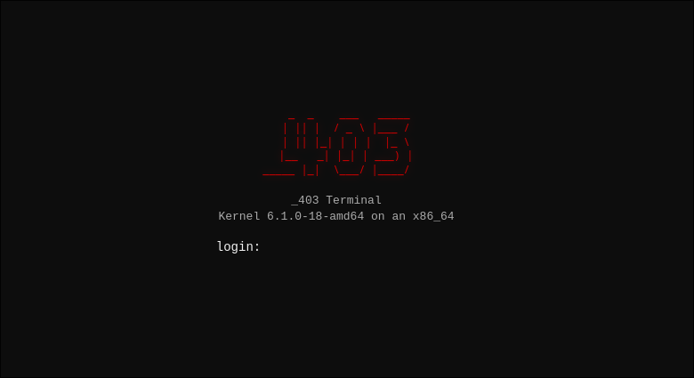

# 🐧 Linux Terminal Simulator

A lightweight, educational, and interactive Linux terminal simulator built from scratch using vanilla web technologies.

---

## 💡 The Project Idea
The primary mission of this project is to **introduce people to the Linux operating system** in an accessible, zero-risk environment. Many users feel intimidated by the command-line interface or fear breaking their system. This simulator breaks down that barrier, allowing students, tech enthusiasts, and curious users to explore commands, navigate file trees, and learn terminal core concepts safely right inside their web browser.

Based on a **Debian GNU/Linux** environment, the simulator replicates system files, default configurations, and shell behaviors to deliver a realistic experience.

---

## 📸 Preview & First Look

To access the simulator, users are greeted by a retro-style ASCII art login screen mimicking a real Debian tty session:

  

---

## 🚀 Live Demo
Experience the environment online instantly:
👉 **[Open the Linux Terminal Simulator](https://alanschaffer.github.io/linux-terminal-simulator/)**

---

## 🎨 Features & System Architecture

### 📁 Virtual File System (VFS)
*   **Realistic Directory Tree:** Includes standard Unix/Linux directories such as `/home`, `/etc`, `/var/log`, `/bin`, `/usr`, `/tmp`, and `/root`.
*   **Dynamic Data Creation:** Users can dynamically interact with the file system using navigation commands.

### ⚙️ Command Simulation Engine
The core logic parses commands along with flags and basic operators. Current simulated categories include:
*   **Navigation & Discovery:** `cd`, `ls` (supports flags like `-l`, `-a`, `-lh`), `pwd`, `tree`, and `whereis`.
*   **File Management:** `touch`, `mkdir`, `cat`, `stat`, and `file`.
*   **System Diagnostics:** `neofetch`, `uname` (supports `-a`, `-r`, `-m`), `uptime`, `df`, `du`, and `free`.
*   **Text Utilities:** Basic output reading and line manipulation utilities.
*   **Session Control:** `clear` / `cls`, `exit`, `logout`, and simulated system states for `reboot` and `shutdown`.

### 🛡️ Interactive Security & Restricted Actions
*   **Sudo Simulation:** Simulates privilege escalation natively.
*   **Dynamic Easter Eggs:** Includes specialized safety boundaries. For educational humor, executing restricted destructive root commands triggers a full-screen customized image rendering a system crash event.

### ⌨️ Advanced Terminal UX
*   **Command History:** Navigate previous commands seamlessly using the `ArrowUp` and `ArrowDown` keys.
*   **Tab Autocomplete:** Mimics standard shell tab completion for directories and files to enhance workflow speed.
*   **Signal Handling:** Supports `Ctrl + C` to abort/cancel lines and `Ctrl + L` to clear the viewport cleanly.

---

## 🛠️ Built With
*   **HTML5** – Application structure and canvas boundaries.
*   **CSS3** – Retro monospace typography, custom layout components, and shadow glowing filters.
*   **Vanilla JavaScript (ES6+)** – DOM manipulation mechanics, input parsing engines, and standard data structure VFS mapping.

---

## 🔧 Future Roadmap (Current Version: Beta)
This simulator is under active development. The upcoming milestones include:

- [ ] **Advanced Theme Engine:** Implementation of a visual customization suite, introducing popular community themes like **Dracula**, Nord, Gruvbox, and Monokai.
- [ ] **Interactive Utilities:** Simulating full-screen interactive binaries such as a light version of the `nano` or `vim` editors.
- [ ] **Enhanced Shell Operators:** Expanding logic chain operators to support deep output redirections.

